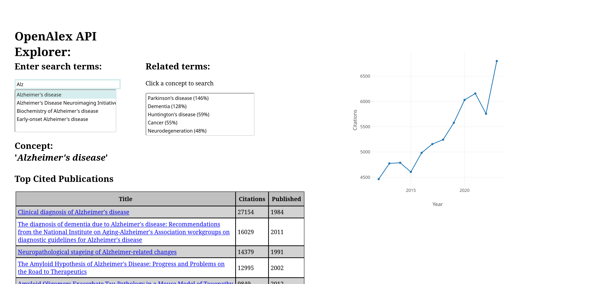

# Knowledge Portal

This is my first experiment writing a Javascript application.

I was exploring the fantastic [OpenAlex project's](https://openalex.org/) in 2022 and wanted to build a quick way to jump between concepts and explore.

Now in 2024, OpenAlex has a fantastic search feature on its home page, but at the time, OpenAlex was new and didn't yet allow the type of visual search I wanted.

This application is a simple MVP of how I wanted to explore Citation data. It also demonstrates the power of providing well-documented API's-- they allow you to build interesting, fit-for-purpose tools!

Usage:

Clone the repo and open `index.html`. This is vanilla javascript, no frameworks-- so it will just work!

## Screenshot of Knowlege Portal

